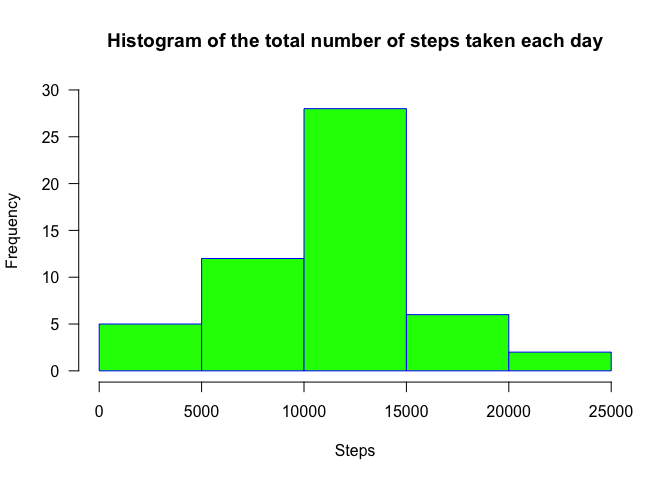
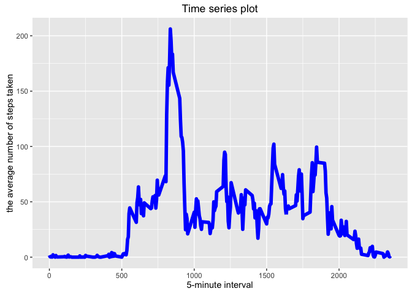
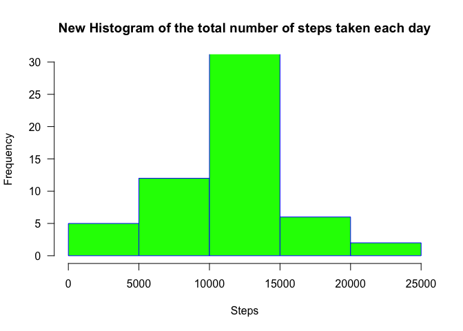
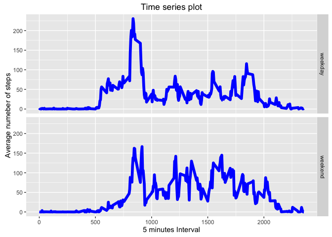

# Reproducible Research: Peer Assessment 1
*By Jiamao Zheng *  
*January 25, 2016*

# Introduction

It is now possible to collect a large amount of data about personal movement using activity monitoring devices such as a Fitbit, Nike Fuelband, or Jawbone Up. These type of devices are part of the "quantified self" movement -- a group of enthusiasts who take measurements about themselves regularly to improve their health, to find patterns in their behavior, or because they are tech geeks. But these data remain under-utilized both because the raw data are hard to obtain and there is a lack of statistical methods and software for processing and interpreting the data.

This assignment makes use of data from a personal activity monitoring device. This device collects data at 5 minute intervals through out the day. The data consists of two months of data from an anonymous individual collected during the months of October and November, 2012 and include the number of steps taken in 5 minute intervals each day.

# Install libraries 

```r
library(dplyr, warn.conflicts = F)
library(ggplot2)
```

# Loading and preprocessing the data


```r
path_file <- '/Users/jiamaozheng/Dropbox/Github_repo/RepData_PeerAssessment1'
setwd(path_file)
raw_data <- read.csv('activity.csv')
raw_data$date <- as.Date(raw_data$date)
head(raw_data)
```

```
##   steps       date interval
## 1    NA 2012-10-01        0
## 2    NA 2012-10-01        5
## 3    NA 2012-10-01       10
## 4    NA 2012-10-01       15
## 5    NA 2012-10-01       20
## 6    NA 2012-10-01       25
```


# What is mean total number of steps taken per day?
  1. Make a histogram of the total number of steps taken each day

```r
processed_data <- raw_data %>%
        group_by(date) %>% 
        summarise(sum = sum(steps)
                  )
head(processed_data)
```

```
## Source: local data frame [6 x 2]
## 
##         date   sum
##       <date> <int>
## 1 2012-10-01    NA
## 2 2012-10-02   126
## 3 2012-10-03 11352
## 4 2012-10-04 12116
## 5 2012-10-05 13294
## 6 2012-10-06 15420
```

```r
hist(processed_data$sum, main = "Histogram of the total number of steps taken each day", 
     xlab = "Steps", 
     border = "blue", 
     col = "green", 
     xlim = c(0, 25000), 
     ylim = c(0, 30), 
     las=1, 
     breaks=5)
```

<!-- -->

  2. Calculate and report the mean and median total number of steps taken per day

```r
 mean(processed_data$sum, na.rm=T)
```

```
## [1] 10766.19
```

```r
 median(processed_data$sum, na.rm =T)
```

```
## [1] 10765
```
The mean of the total number of steps taken per day is 10766.19  
The median of the total number of steps taken per day is 10765


# What is the average daily activity pattern?
  1. Make a time series plot (i.e. type = "l") of the 5-minute interval (x-axis) and the average number of steps taken, averaged across all days (y-axis)

```r
steps_intervals <- aggregate(raw_data$steps, by=list(raw_data$interval), mean, na.rm=TRUE)

names(steps_intervals) = c('interval', 'steps')

ggplot(steps_intervals, 
       aes(x = interval, y  = steps)) + 
  geom_line(col = 'blue', size = 2) + 
  xlab('5-minute interval') +
  ylab('the average number of steps taken') +
  ggtitle('Time series plot')
```

<!-- -->

  2. Which 5-minute interval, on average across all the days in the dataset, contains the maximum number of steps?

```r
steps_intervals[which.max(steps_intervals$steps),]
```

```
##     interval    steps
## 104      835 206.1698
```
Interval 835 contains maximum steps 206.1698

# Imputing missing values
  1. Calculate and report the total number of missing values in the dataset 

```r
sum(is.na(raw_data$steps))
```

```
## [1] 2304
```
The total number of missing values in the dataset is 2304

  2. Devise a strategy for filling in all of the missing values in the dataset. The strategy does not need to be sophisticated. For example, you could use the mean/median for that day, or the mean for that 5-minute interval, etc.  
  The mean for that 5-minute interval was used to filling the missing values in the dataset. 
  
  3. Create a new dataset that is equal to the original dataset but with the missing data filled in.

```r
new_raw_data <- raw_data

for (i in 1:nrow(new_raw_data)) {
    if (is.na(new_raw_data$steps[i])) {
        new_raw_data$steps[i] = subset(steps_intervals, interval == new_raw_data$interval[i])$steps
    }
}
head(new_raw_data)
```

```
##       steps       date interval
## 1 1.7169811 2012-10-01        0
## 2 0.3396226 2012-10-01        5
## 3 0.1320755 2012-10-01       10
## 4 0.1509434 2012-10-01       15
## 5 0.0754717 2012-10-01       20
## 6 2.0943396 2012-10-01       25
```

  4. Make a histogram of the total number of steps taken each day and Calculate and report the mean and median total number of steps taken per day. Do these values differ from the estimates from the first part of the assignment? What is the impact of imputing missing data on the estimates of the total daily number of steps?

```r
processed_data_revised <- new_raw_data %>%
        group_by(date) %>% 
        summarise(sum = sum(steps)
        )
hist(processed_data_revised$sum, main = "New Histogram of the total number of steps taken each day", 
     xlab = "Steps", 
     border = "blue", 
     col = "green", 
     xlim = c(0, 25000), 
     ylim = c(0, 30), 
     las=1, 
     breaks=5)
```

<!-- -->

```r
steps_mean_revised <- mean(processed_data_revised$sum)
steps_median_revised <- median(processed_data_revised$sum)

summary(processed_data)
```

```
##       date                 sum       
##  Min.   :2012-10-01   Min.   :   41  
##  1st Qu.:2012-10-16   1st Qu.: 8841  
##  Median :2012-10-31   Median :10765  
##  Mean   :2012-10-31   Mean   :10766  
##  3rd Qu.:2012-11-15   3rd Qu.:13294  
##  Max.   :2012-11-30   Max.   :21194  
##                       NA's   :8
```

```r
summary(processed_data_revised)
```

```
##       date                 sum       
##  Min.   :2012-10-01   Min.   :   41  
##  1st Qu.:2012-10-16   1st Qu.: 9819  
##  Median :2012-10-31   Median :10766  
##  Mean   :2012-10-31   Mean   :10766  
##  3rd Qu.:2012-11-15   3rd Qu.:12811  
##  Max.   :2012-11-30   Max.   :21194
```
The mean stay the same because the mean was used to fill in missing values, but the median has a slight different value because it depends the relative rank of missing values. 

# Are there differences in activity patterns between weekdays and weekends?
  1. Create a new factor variable in the dataset with two levels -- "weekday" and "weekend" indicating whether a given date is a weekday or weekend day.

```r
weekdays1 <- c('Monday', 'Tuesday', 'Wednesday', 'Thursday', 'Friday')
new_raw_data$wDay <- c('weekend', 'weekday')[(weekdays(new_raw_data$date) %in% weekdays1) +1L]
```

  2. Make a panel plot containing a time series plot (i.e. type = "l") of the 5-minute interval (x-axis) and the average number of steps taken, averaged across all weekday days or weekend days (y-axis). The plot should look something like the following, which was created using simulated data:

```r
weekend = subset(new_raw_data, new_raw_data$wDay == 'weekend')
step_intervals_weekend = aggregate(weekend$steps, by=list(weekend$interval), mean)
step_intervals_weekend$wDay = 'weekend'

weekday = subset(new_raw_data, new_raw_data$wDay == 'weekday')
step_intervals_weekday = aggregate(weekday$steps, by=list(weekday$interval), mean)
step_intervals_weekday$wDay = 'weekday'

step_intervals_revised = rbind(step_intervals_weekend, step_intervals_weekday)

names(step_intervals_revised) = c('interval', 'steps', 'xDay')
ggplot(step_intervals_revised, aes(x = interval, y  = steps)) + 
  facet_grid(xDay~.) + 
  geom_line(col = 'blue', size = 2) + 
  xlab('5 minutes Interval') +
  ylab('Average numeber of steps') +
  ggtitle('Time series plot')
```

<!-- -->


